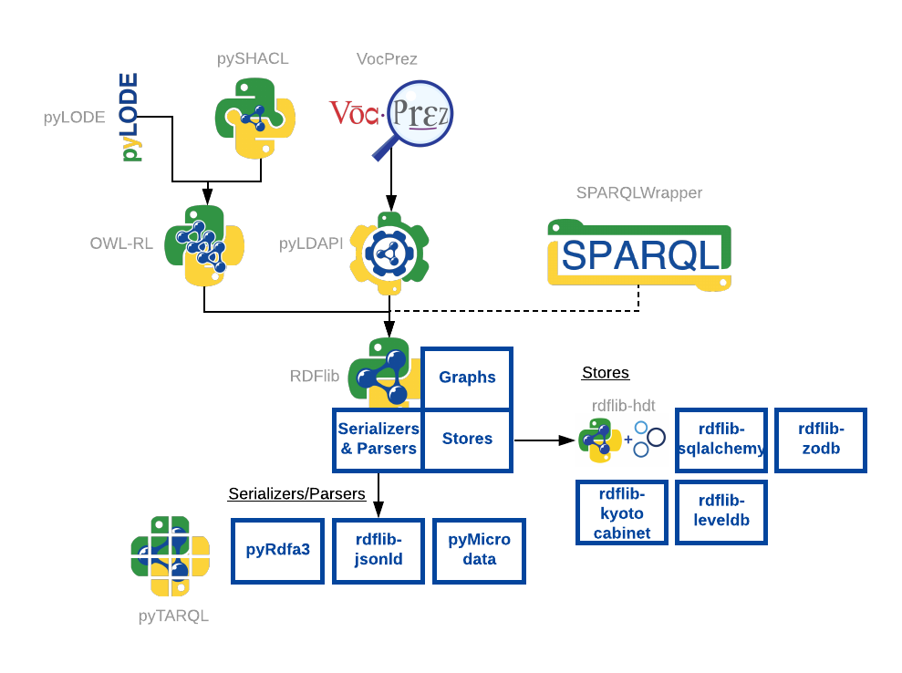

# RDFlib
RDFLib is a pure Python package work working with [RDF](http://www.w3.org/RDF/). RDFLib contains most things you need to work with RDF, including:

* parsers and serializers for RDF/XML, N3, NTriples, N-Quads, Turtle, TriX, Trig and JSON-LD (via a plugin).
* a Graph interface which can be backed by any one of a number of Store implementations
* store implementations for in-memory storage and persistent storage on top of the Berkeley DB
* a SPARQL 1.1 implementation - supporting SPARQL 1.1 Queries and Update statements

## RDFlib Family of packages
The RDFlib community maintains many RDF-related Python code repositories with different purposes. Most of the currently 
operating packages are shown in Figure 1.

  
**Figure 1**: Packages within the RDFlib family. 

* **Core**:
    * [rdflib](https://github.com/RDFLib/rdflib) - the rdflib core

* **Parsers/Serializers**:
    * [rdflib-jsonld](https://github.com/RDFLib/rdflib-jsonld) - an rdflib plugin that is an implementation of JSON-LD
    * [pymicrodata](https://github.com/RDFLib/pymicrodata) - This a module to extract RDF from an HTML5 page annotated with microdata
    * [pyrdfa3](https://github.com/RDFLib/pyrdfa3) - RDFa 1.1 distiller/parser library: can extract RDFa 1.1 (and RDFa 1.0, if properly set via a @Version attribute) from (X)HTML, SVG, or XML
    
* **Stores**:     
    * [rdflib-hdt](https://github.com/RDFLib/rdflib-hdt) - A Store back-end for rdflib to allow for reading and querying HDT documents
    * [rdflib-zodb](https://github.com/RDFLib/rdflib-zodb) - RDFLib Store backed by ZODB3
    * [rdflib-kyotocabinet](https://github.com/RDFLib/rdflib-kyotocabinet) - RDFLib Store backed by Kyoto Cabinet
    * [rdflib-leveldb](https://github.com/RDFLib/rdflib-leveldb) - A LevelDB based Store for rdflib
    * [rdflib-sqlalchemy](https://github.com/RDFLib/rdflib-sqlalchemy) - RDFLib store using SQLAlchemy dbapi as back-end 
    
* **SPARQL tools**:
    * [sparqlwrapper](https://github.com/RDFLib/sparqlwrapper) - a simple Python wrapper around a SPARQL service to remotely execute your queries
    
* **OWL Reasoning & Documentation**:    
    * [OWL-RL](https://github.com/RDFLib/OWL-RL) - A simple implementation of the OWL2 RL Profile on top of RDFLib
    * [pyLODE](https://github.com/RDFLib/pyLODE) - An OWL ontology documentation tool using Python and templating, based on LODE.
    
* **SHACL validation**:
    * [pySHACL](https://github.com/RDFLib/pySHACL) - A Python validator for SHACL 
    
* **Linked Data APIs**:
    * [pyLDAPI](https://github.com/RDFLib/pyLDAPI) - A very small module to add Linked Data API functionality to a Python Flask installation

* **Derived tools**:  
    * [VocPrez](https://github.com/RDFLib/VocPrez) - A tool (API and web front-end), based on pyLDAPI, for the read-only delivery system of SKOS vocabularies. 

Please see the list of all packages here:

* <https://github.com/RDFLib>

## Documentation
See <https://rdflib.readthedocs.io> for our documentation built from the code.

## Support
For general "how do I..." queries, please use https://stackoverflow.com and tag your question with `rdflib`. Existing 
questions:

* <https://stackoverflow.com/questions/tagged/rdflib>

## Releases
*rdflib 5.0.0 has just been released and 6.0.0 is now being word on - April 2020.*

**Release** | **Date** | **Note**
--- | --- | ---
*6.0.0* | *Late 2021 (expected)* | *The release of `master` at some point in late 2021*
*6.0.0a0* | April 2020+ | Current `master` The pending alpha release of 6.0.0. No support for Python < 3.6
**5.0.0** | **18 Apr 2020** | **Current stable release.** Release of `master` contents as of 18 Apr 2020 Last release with Python 2 & 3.4 support Documentation: [readthedocs/latest](https://rdflib.readthedocs.io/en/latest/)
5.0.0RC1 | 04 Apr 2020 | This was a pre-release of all changes in `master` as of 04 Apr 2020
4.2.2 | 30 Jan 2017 | Previous stable release. Documentation: [readthedocs/4.2.2](https://rdflib.readthedocs.io/en/4.2.2/)
... | ... | ...
1.1.1 | 12 Nov 2002 | First release!

## Contributing
rdflib survives and grows via user contributions! Please consider lodging Pull Requests here:

* <https://github.com/RDFLib/rdflib/pulls>

You can also raise issues here:

* <https://github.com/RDFLib/rdflib/issues>

## Contacts
If you want to contact the rdflib maintainers, please do so via the rdflib-dev mailing list:

* <https://groups.google.com/group/rdflib-dev>
